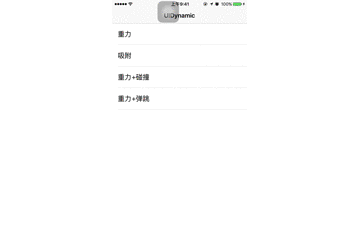

## iOS物理动画引擎-UIDynamic

### UIDynamicBehavior 仿真行为

1. 创建一个仿真者,用来仿真所有的物理行为

<pre>
 animator = [[UIDynamicAnimator alloc] initWithReferenceView:self.view]
 </pre>
2. 创建具体的物理仿真行为

<pre>
gravity = [[UIGravityBehavior alloc]init]
collision = [[UICollisionBehavior alloc]init]
snapBehavior = [[UISnapBehavior alloc] init]
itemBehavior = [[UIDynamicItemBehavior alloc] init]
</pre>
3. 将物理仿真行为添加给仿真者实现仿真效果。

<pre>
 -(void)addBehavior:(UIDynamicBehavior *)behavior;
 -(void)removeBehavior:(UIDynamicBehavior *)behavior;
 -(void)removeAllBehaviors;
</pre>

### UIGravityBehavior 重力行为

* 创建仿真者

<pre>
 self.animator = [[UIDynamicAnimator alloc] initWithReferenceView:self.view];
</pre>

* 创建仿真行为

<pre>
-(UIGravityBehavior *)gravity{
    if (_gravity == nil) {
        _gravity = [[UIGravityBehavior alloc]init];
    }
    return _gravity;
}
-(UICollisionBehavior *)collision{
    if (_collision == nil) {
        _collision = [[UICollisionBehavior alloc]init];
    }
    return _collision;
}
</pre>

* 触碰屏幕生成重力小球

<pre>
-(void)touchesBegan:(NSSet<UITouch *> *)touches withEvent:(UIEvent *)event{
    UITouch * touch = touches.anyObject;
    CGPoint location = [touch locationInView:self.view];
    self.redView = [[UIView alloc]initWithFrame:CGRectMake(0, 0, widthRed, widthRed)];
    self.redView.center = location;
    [self.view addSubview:self.redView];
    
    // 随机色方块
    self.redView.backgroundColor = randomColor;
    
    // 创建重力的物理仿真行为，并设置具体的items(需要仿真的view)
    [self.gravity addItem:self.redView];
    
    // 下落方向
    // [gravity setAngle:0.5];
    
    // 创建弹性的物理仿真行为，并设置具体的items(需要仿真的view)
    [self.collision addItem:self.redView];
    self.collision.translatesReferenceBoundsIntoBoundary = YES;

    // 将重力仿真行为添加给仿真者实现仿真效果，开始仿真
    [self.animator addBehavior:self.gravity];
    [self.animator addBehavior:self.collision];
    
}
</pre>

### UICollisionBehavior 碰撞行为

* 创建仿真者

<pre>
 self.animator = [[UIDynamicAnimator alloc] initWithReferenceView:self.view];
</pre>

* 创建碰撞对象

<pre>
self.greenView = [[UIView alloc] initWithFrame:CGRectMake(100, 200, 100, 30)];
self.greenView.backgroundColor = [UIColor greenColor];
[self.view addSubview:self.greenView];
    
self.blueView = [[UIView alloc] initWithFrame:CGRectMake(120, 300, 100, 30)];
self.blueView.backgroundColor = [UIColor blueColor];
[self.view addSubview:self.blueView];

  //未绑定仿真对象  
self.blackView = [[UIView alloc] initWithFrame:CGRectMake(140, 400, 100, 30)];
self.blackView.backgroundColor = [UIColor blackColor];
[self.view addSubview:self.blackView];
  
  // 物体角度  
self.blueView.transform =  CGAffineTransformMakeRotation(M_PI_4);
self.greenView.transform = CGAffineTransformMakeRotation(-M_PI / 8);
   
</pre>

* 创建仿真行为

<pre>
-(UIGravityBehavior *)gravity{
    if (_gravity == nil) {
        _gravity = [[UIGravityBehavior alloc]init];
    }
    return _gravity;
}
-(UICollisionBehavior *)collision{
    if (_collision == nil) {
        _collision = [[UICollisionBehavior alloc]init];
    }
    return _collision;
}
</pre>

* 开始碰撞行为

<pre>
-(void)touchesBegan:(NSSet<UITouch *> *)touches withEvent:(UIEvent *)event{
    // 获取点击位置，生成仿真者
    UITouch * touch = touches.anyObject;
    CGPoint location = [touch locationInView:self.view];
    self.redView = [[UIView alloc]initWithFrame:CGRectMake(0, 0, widthRed, widthRed)];
    self.redView.center = location;
    // pch中宏定义的随机色
    self.redView.backgroundColor = randomColor;
    [self.view addSubview:self.redView];
    [self.gravity addItem:self.redView];
    // 添加碰撞检测
    [self.collision addItem:self.redView];
    [self.collision addItem:self.greenView];
    [self.collision  addItem:self.blueView];
    self.collision.translatesReferenceBoundsIntoBoundary = YES;
    self.collision.collisionDelegate = self;
    
    
   __weak typeof(self) weakSelf = self;
        // 获取方块运动轨迹坐标
    self.collision.action = ^{
        NSLog(@"%@", NSStringFromCGRect(weakSelf.redView.frame));
        
    };

    CGFloat Y = self.view.frame.size.height;
    CGFloat X = self.view.frame.size.width;
    CGFloat height = self.view.frame.size.height;
    
    //设置红色的View为底边界,左边框跟右边框作为边界
    [self.collision addBoundaryWithIdentifier:@"collision1" fromPoint:CGPointMake(0,Y) toPoint:CGPointMake(X, Y)];
    [self.collision addBoundaryWithIdentifier:@"collision2" fromPoint:CGPointMake(0, 0) toPoint:CGPointMake(0, height)];
    [self.collision addBoundaryWithIdentifier:@"collision3" fromPoint:CGPointMake(X,0) toPoint:CGPointMake(X, height)];
    [self.animator addBehavior:self.collision];
    [self.animator addBehavior:self.gravity];  
}
</pre>

* 碰撞开始时给被碰撞的物体添加重力仿真

<pre>
// UICollisionBehavior 代理行为
- (void)collisionBehavior:(UICollisionBehavior*)behavior beganContactForItem:(id <UIDynamicItem>)item withBoundaryIdentifier:(nullable id <NSCopying>)identifier atPoint:(CGPoint)p{
    
    if ([item isEqual:self.greenView]) {
        UIGravityBehavior * gravity = [[UIGravityBehavior alloc] initWithItems:@[self.greenView]];
        [self.animator addBehavior:gravity];
    }else if ([item isEqual:self.blueView]){
        UIGravityBehavior * gravity = [[UIGravityBehavior alloc] initWithItems:@[self.blueView]];
        [self.animator addBehavior:gravity];
    }
    
}
</pre>

### UISnapBehavior 吸附行为

* 创建仿真者

<pre>
self.animator = [[UIDynamicAnimator alloc] initWithReferenceView:self.view];
</pre>

* 创建吸附对象

<pre>
-(UIView *)redView{
    if (_redView ==nil) {
        _redView = [[UIView alloc]initWithFrame:CGRectMake(p.x, p.y, 50, 50)];
        _redView.backgroundColor = [UIColor redColor];
        [self.view addSubview:_redView];
    }
    return _redView;
}
</pre>

* 开始吸附行为

<pre>
-(void)touchesBegan:(NSSet<UITouch *> *)touches withEvent:(UIEvent *)event{
    
    [self.animator removeAllBehaviors];
    UITouch * touch = touches.anyObject;
    CGPoint location = [touch locationInView:self.view];
    p = location;
    NSLog(@"%@",NSStringFromCGPoint(location));
     // 3 添加吸附事件
     UISnapBehavior *snap = [[UISnapBehavior alloc] initWithItem:self.redView snapToPoint:location];
    // 改变震动幅度，0表示振幅最大，1振幅最小
    snap.damping = 0.5;
    // 4. 将吸附事件添加到仿真者行为中
    [self.animator addBehavior:snap];
    
}
</pre>

### UIDynamicItemBehavior 迅猛移动弹跳摆动行为

* 创建仿真者

<pre>
self.animator = [[UIDynamicAnimator alloc] initWithReferenceView:self.view];
</pre>

* 创建仿真行为

<pre>
-(UIGravityBehavior *)gravity{
    if (_gravity == nil) {
        _gravity = [[UIGravityBehavior alloc]init];
    }
    return _gravity;
}
-(UICollisionBehavior *)collision{
    if (_collision == nil) {
        _collision = [[UICollisionBehavior alloc]init];
         [_collision addBoundaryWithIdentifier:@"barrier" forPath:[UIBezierPath bezierPathWithRect:self.view.bounds]];
        _collision.translatesReferenceBoundsIntoBoundary = YES;
    }
    return _collision;
}
-(UIDynamicItemBehavior *)itemBehavior{
    if (_itemBehavior == nil) {
        _itemBehavior = [[UIDynamicItemBehavior alloc] init];
        _itemBehavior.elasticity = 1;
    }
    return _itemBehavior;
}
</pre>

* 生成小球，添加仿真事件

<pre>
-(void)touchesAddSquareView{
    float  viewWidth = 20;
    UIView * view = [[UIView alloc]initWithFrame:CGRectMake(p.x, p.y, viewWidth, viewWidth)];
    view.layer.cornerRadius = viewWidth / 2.0;
    view.backgroundColor = randomColor;
    [self performSelector:@selector(removeView:) withObject:view afterDelay:10];
    [self.view addSubview:view];
    [self.collision addItem:view];
    [self.itemBehavior addItem:view];
    [self.gravity addItem:view];
    [self.animator addBehavior:self.collision];
    [self.animator addBehavior:self.itemBehavior];
    [self.animator addBehavior:self.gravity];
    
}
</pre>

* 点触，移动和松开创建小球

<pre>
- (void)touchesBegan:(NSSet<UITouch *> *)touches withEvent:(UIEvent *)event
{
    UITouch * touch = touches.anyObject;
    CGPoint location = [touch locationInView:self.view];
    p = location;
    [self touchesAddSquareView];
}

- (void)touchesMoved:(NSSet<UITouch *> *)touches withEvent:(UIEvent *)event
{
    UITouch * touch = touches.anyObject;
    CGPoint location = [touch locationInView:self.view];
    p = location;
   [self touchesAddSquareView];
}
- (void)touchesEnded:(NSSet<UITouch *> *)touches withEvent:(UIEvent *)event
{
    [self touchesAddSquareView];
}
</pre>

* 10s后删除小球和其物理仿真行为

<pre>
-(void)removeView:(UIView *)view{
    if (view == nil) {
        return;
    }
    [UIView animateWithDuration:.5 animations:^{
        view.alpha = 0;
    } completion:^(BOOL finished) {
        [view removeFromSuperview];
        [self.collision removeItem:view];
        [self.itemBehavior removeItem:view];
        [self.gravity removeItem:view];
    }];
    
}
</pre>

